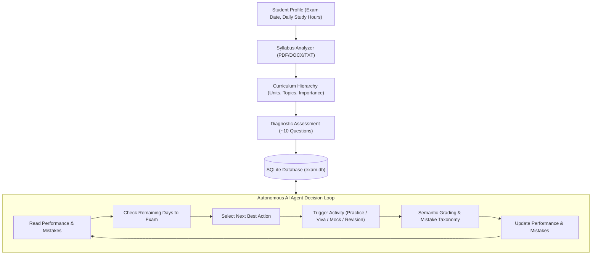

# PrepPilot – AI Adaptive Exam Preparation Agent

PrepPilot is an autonomous AI-powered exam preparation application built with **Streamlit**, **SQLite**, and dual-provider LLM integration (**Google Gemini** & **OpenAI**-compatible models). 

Instead of generic chatbot interactions, PrepPilot acts as an active **pedagogical agent**: it parses your uploaded syllabus (PDF/DOCX/TXT), diagnoses baseline knowledge, tailors questions to your exact topics, tracks cognitive mistakes, conducts interactive text-based viva examinations, simulates timed full-length mock exams, and dynamically schedules study sessions prioritizing weak areas.

---

## Architecture & Agent Workflow



---

## Core Features

1. **Student Profile & Mandatory Exam Date**:
   - Calculates real-time countdown: $\text{Days Remaining} = \text{Exam Date} - \text{Current Date}$.
   - Remembers profiles in SQLite without any fake/demo records.
2. **Syllabus Parsing & Topic Extraction**:
   - Ingests `.pdf`, `.docx`, and `.txt` files.
   - Extracts Subject, Units, Topics, Subtopics, Estimated Difficulty, and Exam Importance (High / Medium / Low).
   - Generates interactive ASCII curriculum tree.
3. **Strict Grounding in Uploaded Syllabus**:
   - 100% of generated questions, notes, and viva prompts originate strictly from the uploaded syllabus.
4. **Autonomous AI Agent ("Next Best Action")**:
   - Displays a prominent action card on the Dashboard recommending the highest-yield learning task (e.g. *Revise 2NF $\rightarrow$ Take 5 Easy Questions*).
   - Dynamic adaptive difficulty thresholds:
     - Accuracy $< 50\% \rightarrow$ Easy (Foundational remediation)
     - Accuracy $50\% - 75\% \rightarrow$ Medium (Standard exam challenge)
     - Accuracy $> 75\% \rightarrow$ Hard (Advanced problem-solving or Viva defense)
5. **Semantic Short-Answer Evaluation**:
   - No naive string matching. Evaluates answers semantically with 3-part constructive feedback:
     - What was correct
     - What was missing
     - What should be improved
6. **Mistake Memory & Taxonomy**:
   - Classifies errors into 6 cognitive categories:
     - *Concept misunderstanding*, *Forgot definition*, *Calculation error*, *Confused concepts*, *Careless mistake*, *Incomplete answer*.
   - Generates targeted micro-lessons and rule-of-thumb memory hooks.
7. **Conversational AI Viva (Text-Based Oral Exam)**:
   - Interactive examiner that asks one syllabus-grounded question at a time.
   - Probes student responses with intelligent, adaptive follow-up questions.
   - Saves final appraisal and score out of 10 to SQLite.
8. **Timed Mock Exam Engine**:
   - Generates full-length exams balanced across all syllabus units.
   - Real-time countdown timer with detailed post-exam breakdown.
9. **Personalized Study Planner with Non-Destructive Rescheduling**:
   - Distributes topics across available study slots before the exam date.
   - If a student misses a slot, clicks *Missed* to slip the topic into the next available future slot without wiping the rest of the plan.
10. **Zero Fake/Demo Mode**:
    - Clean slate architecture. Starts completely empty with real database persistence.

---

## Folder Structure

```text
PrepPilot/
│
├── app.py                     # Main Streamlit web application & routing
├── agent.py                   # Autonomous AI Agent decision engine
├── database.py                # SQLite connection factory, schema & CRUD
├── pdf_reader.py              # Multi-format document text extractor (PDF, DOCX, TXT)
├── syllabus_analyzer.py       # Syllabus hierarchy parser & tree formatter
├── question_generator.py      # Diagnostic, practice, and mock question generator
├── performance_analyzer.py    # Accuracy metrics & Preparation Readiness calculator
├── study_planner.py           # Timetable generator & non-destructive rescheduling
├── viva.py                    # Text-based multi-turn oral exam simulator
├── mistake_memory.py          # Mistake ledger, analytics, and targeted remediation
├── ai_service.py              # Unified Gemini & OpenAI client wrapper
├── utils.py                   # Custom CSS styling and Plotly visualization charts
├── requirements.txt           # Project dependencies
├── .env.example               # Environment variables template
├── README.md                  # Comprehensive documentation
│
├── data/
│   └── exam.db                # SQLite database (auto-initialized)
│
└── uploads/                   # Temporary directory for uploaded syllabus files
```

---

## Installation & Setup

### 1. Prerequisites
- Python 3.10 or higher.
- A valid Google Gemini API Key or OpenAI API Key.

### 2. Virtual Environment Setup

Open terminal in the project directory:

```powershell
cd d:\Antigravity\PrepPilot
python -m venv venv
venv\Scripts\activate
```

*(On Linux / macOS: `source venv/bin/activate`)*

### 3. Install Dependencies

```powershell
pip install -r requirements.txt
```

### 4. Configure Environment Variables

Copy `.env.example` to `.env`:

```powershell
copy .env.example .env
```

Edit `.env` to configure your API key:

```text
AI_API_KEY=your_actual_api_key_here
AI_PROVIDER=gemini
AI_MODEL=gemini-2.5-flash
```

*(Note: You can also enter and update your API key anytime directly inside the **Settings** tab in the running Streamlit web app).*

---

## How to Run

Launch the Streamlit app:

```powershell
streamlit run app.py
```

The application will automatically initialize `data/exam.db` and open in your default browser at `http://localhost:8501`.

---

## Database Schema Reference (`data/exam.db`)

The SQLite database contains 11 relational tables:

| Table | Purpose |
| :--- | :--- |
| `students` | Stores student profile, course, semester, exam date, and daily study hours. |
| `subjects` | Tracks student subjects. |
| `syllabus` | Stores raw uploaded syllabus text and metadata. |
| `topics` | Stores extracted units, topic names, difficulty, and priority weight. |
| `questions` | Question repository cached with options, answers, and explanations. |
| `attempts` | Logs all question submissions, scores, semantic feedback, and timestamps. |
| `performance` | Tracks per-topic cumulative attempts, correct count, and accuracy. |
| `mistakes` | Logs incorrect attempts with cognitive mistake taxonomy. |
| `study_plan` | Daily revision timetable slots with completion/missed status. |
| `mock_tests` | Records full-length mock exam scores, duration, and accuracy. |
| `viva_sessions` | Transcripts, overall marks, and qualitative feedback from oral vivas. |

---

## Adaptive Learning Workflow

1. **Upload Syllabus**: Extracts topics and visualizes the structure.
2. **Diagnostic Test**: Takes a 10-question baseline exam across all units.
3. **Dashboard AI Agent**: Analyzes your results and prescribes your **Next Best Action**.
4. **Targeted Practice**: Rebuilds weak topics with Easy questions; challenges mastered topics with Medium/Hard drills.
5. **Mistake Review**: Generates pedagogical remediation for recurring mistakes.
6. **Viva & Mock Exam**: Tests real-time recall under oral examination and timed exam pressure.
7. **Dynamic Study Planner**: Keeps you on track day-by-day leading up to your exam.
